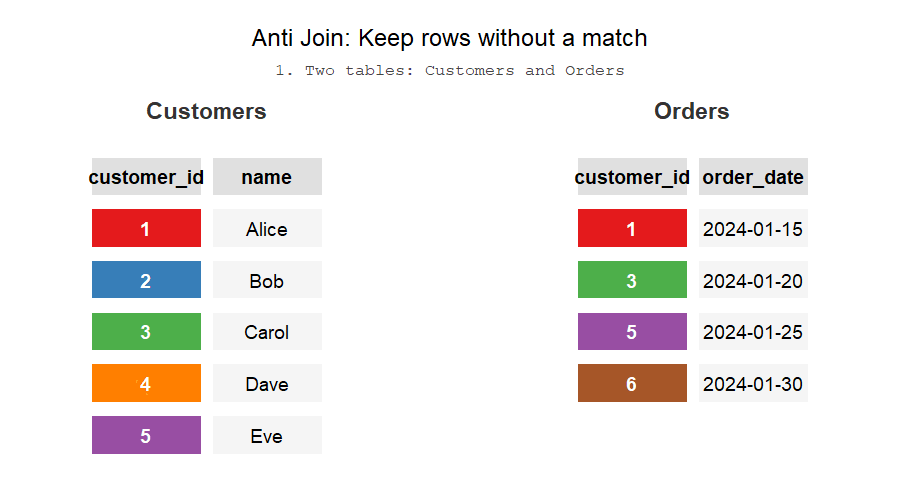

```{r setup}
#| echo: false
#| message: false
#| warning: false

library(duckdb)

con <- dbConnect(duckdb(), "../databases/cookbook.duckdb", read_only = TRUE)

```

If you're here, there's a high chance you know of the simple suite of joins.

When it comes to joins, my head is usually in either of two spaces: it's either just a series of inner and left joins or it's something else to achieve a certain table. For example, I use a full outer join pretty much in cases where I need a full combination from two tables and nowhere else.

If I could write a blog post, I would probably just dump interesting cases of using joins in ways that are not entirely obvious on first glance. What comes to mind:

* anti joins
* non-equi joins
* full outer joins
* filtering when joining to avoid a CTE

This basics chapter delves into 

## Natural Keys, Surrogate Keys

When joining tables together, you need columns by which to join on! If you're working with data from a system – whether it's data from an API or a backend database – it's very likely the data carries some sort of unique identifier. These identifiers are called *surrogate keys* or *primary keys*. You can expect each object in the system's database to have a primary key because that's how a system can relate different objects (usually, tables) together. The keys will usually be either integers or UUIDs. The keys by themselves are not derived from application data and carry no meaning outside of the system. 

A table will usually have a primary key but it may also contain one or more *foreign keys*. Foreign keys are columns that contain values of primary keys from other tables. For example, a table of orders might have a foreign key _order_user_id_ that contains values of the primary key _user_id_ from the users table. The system can lookup who made the order. We, as analysts, can join those tables together.

It's common to join data from different systems that do not share any surrogate keys between them. However, primary keys only have meaning within the boundaries of the system. For example, if I have a list of leads from a web form, my only option to join data is using the emails. This is an example of *natural keys*. Natural keys are identifiers as well but they carry some sort of meaning outside of the system. Examples of natural keys include emails, telephone numbers, personal numbers, SSNs, contract numbers, addresses. Depending on the context, natural keys may or may not be unique in a table but they usually help us uniquely identify an object in the real world. If I tell you my home address, you would be able to find me on a map. Because of this, I like to call them *semantic keys* because they carry some sort of meaning.

Joining using natural keys requires more scrutiny because the data you're using might not be unique based on the natural key. For example, maybe two different users can input the same telephone number in your registration form. Or perhaps an employee had a new account created so now the same employee occurs twice in your database. Luckily, software these days is built to handle these cases but it's up to the analyst to understand the structure of the data and what process is applied to handling natural keys.    

## Cross joins

I sometimes like to think of joins in terms of set theory. Hypothetically, noone is stopping us from writing this query

like this

They would both return the same result after all! In fact, Oracle SQL or ANSI-89 syntax leans on this, the syntax would look like this:

```{sql}
#| eval: false

select *
from subscriptions,tiers,users
where 
  subscription_tier_id = tier_id
  and subscription_user_id = user_id

```

Whenever we're doing filtering/joining, we are essentially doing the same operation - essentially constraining the set of candidate rows we are interested in. Why is this approach useful? Why is this lens a useful perspective? Also, maybe check out R4DS as they do a great illustration of this? Maybe even replicate it using ojs or ts to make it interactive? 

## Left, right, outer joins

When doing left joins, there's a few tricks that are not obvious but are incredibly useful. First, is the anti join where after you had joined the rows you only keep the ones that didn't have a matching row. For example:

The second trick relates to the fact that you can put any condition in the join clause. If you put a filtering condition in the join then you can join rows on some condition but also only rows that meet some criteria overall. For example:

You can't put the condition in the WHERE clause because filtering happens after the join - essentially that would transform the join into an INNER JOIN. 

Anti joins are one way of filtering out rows. For more, see the section on filtering.

## Anti joins

ANTI is not a join type, what gives? Imagine doing a left join: some rows will return a NULL from the joined table and some will be filled. If you were to filter the result set to keep only filled rows, you basically do an INNER join. But if you filter to only keep rows with NULL values, you end up with a table of rows that didn't have a matching row. In other words, the reverse of the INNER JOIN allows you to remove rows from one table based on matching rows in another.



```{ojs}
//| echo: false
antiJoinStatusColors = ({
  "kept":    "#C8E6C9",
  "removed": "#FFCDD2",
  "neutral": "#F5F5F5"
})

antiJoinSqlLines = [
  "SELECT",
  "  u.user_id,",
  "  u.name",
  "FROM users AS u",
  "LEFT JOIN cancelled AS c",
  "  ON u.user_id = c.user_id",
  "WHERE c.user_id IS NULL"
]

antiJoinSteps = [
  {
    title: "1. Left table (users) — all users we want to filter",
    data: [
      {user_id: 1, name: "Alice", _status: "neutral"},
      {user_id: 2, name: "Bob",   _status: "neutral"},
      {user_id: 3, name: "Carol", _status: "neutral"},
      {user_id: 4, name: "Dave",  _status: "neutral"}
    ],
    cols: ["user_id", "name"],
    highlight: [0, 1, 2, 3]
  },
  {
    title: "2. Right table (cancelled) — the users we want to exclude",
    data: [
      {user_id: 2, name: "Bob",  _status: "neutral"},
      {user_id: 4, name: "Dave", _status: "neutral"}
    ],
    cols: ["user_id", "name"],
    highlight: [4, 5]
  },
  {
    title: "3. LEFT JOIN — every users row is kept; matched rows fill in, unmatched rows get NULL",
    data: [
      {user_id: 1, name: "Alice", "c.user_id": "NULL", _status: "kept"},
      {user_id: 2, name: "Bob",   "c.user_id": 2,      _status: "removed"},
      {user_id: 3, name: "Carol", "c.user_id": "NULL", _status: "kept"},
      {user_id: 4, name: "Dave",  "c.user_id": 4,      _status: "removed"}
    ],
    cols: ["user_id", "name", "c.user_id"],
    highlight: [3, 4, 5]
  },
  {
    title: "4. WHERE c.user_id IS NULL — keep only rows that had no match in cancelled",
    data: [
      {user_id: 1, name: "Alice", _status: "kept"},
      {user_id: 3, name: "Carol", _status: "kept"}
    ],
    cols: ["user_id", "name"],
    highlight: [6]
  }
]
```

```{ojs}
//| echo: false
viewof antiJoinStepIndex = {
  let index = 0

  const btnStyle = `
    font-size: 1.2em;
    padding: 4px 14px;
    cursor: pointer;
    border: 1px solid #ccc;
    border-radius: 4px;
    background: #f5f5f5;
  `

  const prev = Object.assign(document.createElement("button"), { textContent: "←" })
  const next = Object.assign(document.createElement("button"), { textContent: "→" })
  prev.style.cssText = btnStyle
  next.style.cssText = btnStyle

  const counter = document.createElement("span")
  counter.style.cssText = "font-size:0.9em;color:#666;margin:0 10px"

  const container = document.createElement("div")
  container.style.cssText = "display:flex;align-items:center;margin-bottom:12px"
  container.append(prev, counter, next)

  const update = () => {
    counter.textContent = `${index + 1} / ${antiJoinSteps.length}`
    prev.disabled = index === 0
    next.disabled = index === antiJoinSteps.length - 1
    container.value = index
    container.dispatchEvent(new CustomEvent("input"))
  }

  prev.onclick = () => { if (index > 0) { index--; update() } }
  next.onclick = () => { if (index < antiJoinSteps.length - 1) { index++; update() } }

  container.value = index
  update()
  return container
}

{
  const s = antiJoinSteps[antiJoinStepIndex]

  const root = document.createElement("div")

  const titleEl = document.createElement("div")
  titleEl.style.cssText = "font-weight:600;color:#333;margin-bottom:14px;font-size:1em"
  titleEl.textContent = s.title
  root.appendChild(titleEl)

  const layout = document.createElement("div")
  layout.style.cssText = "display:flex;flex-direction:column;gap:12px"

  let sqlVisible = true
  const toggle = document.createElement("button")
  toggle.style.cssText = [
    "align-self:flex-start",
    "font-size:0.82em",
    "padding:3px 10px",
    "cursor:pointer",
    "border:1px solid #ccc",
    "border-radius:4px",
    "background:#f5f5f5",
    "color:#444"
  ].join(";")
  const setToggleLabel = () => { toggle.textContent = sqlVisible ? "▾ Hide SQL" : "▸ Show SQL" }
  setToggleLabel()

  const pre = document.createElement("pre")
  pre.style.cssText = [
    "font-family:monospace",
    "font-size:0.82em",
    "line-height:1.55",
    "background:#F8F8F8",
    "border:1px solid #DDD",
    "border-radius:6px",
    "padding:14px 6px",
    "margin:0",
    "overflow:auto"
  ].join(";")

  toggle.onclick = () => {
    sqlVisible = !sqlVisible
    pre.style.display = sqlVisible ? "" : "none"
    setToggleLabel()
  }

  antiJoinSqlLines.forEach((line, i) => {
    const row = document.createElement("div")
    const hl = s.highlight.includes(i)
    row.style.cssText = [
      `background:${hl ? "#FFF9C4" : "transparent"}`,
      `font-weight:${hl ? "600" : "normal"}`,
      "padding:0 10px",
      "white-space:pre",
      "border-radius:3px"
    ].join(";")
    row.textContent = line
    pre.appendChild(row)
  })

  layout.append(toggle, pre)

  const tableWrap = document.createElement("div")
  tableWrap.style.cssText = "overflow:auto"

  const th = s.cols.map(c =>
    `<th style="background:#E0E0E0;padding:8px 14px;border:2px solid white;font-weight:700">${c}</th>`
  ).join("")

  const tbody = s.data.map(row => {
    const bg = antiJoinStatusColors[row._status] ?? "#F5F5F5"
    const tds = s.cols.map(c =>
      `<td style="background:${bg};padding:8px 14px;border:2px solid white">${row[c] ?? ""}</td>`
    ).join("")
    return `<tr>${tds}</tr>`
  }).join("")

  tableWrap.innerHTML = `<table style="border-collapse:collapse;font-size:0.9em">
    <thead><tr>${th}</tr></thead>
    <tbody>${tbody}</tbody>
  </table>`

  layout.append(tableWrap)
  root.appendChild(layout)
  return root
}
```

This is an important implication because your other options are either the IN operator or the WHERE EXISTS clause. The problem with the IN operator is that it's not efficient and the latter is more verbose. The alternating are laid out in the [filtering](03-recipes/filtering.qmd) chapter. 


## Range joins

Range joins, also known as non-equi joins, are amazing when done right. Range joins are essentially a multiplication operation - you're creating a combination of rows based on constraints. In this way, range joins are a kind of cartesian join with a filter condition on top - to be fair, that's how I think of them myself. For example, this code:

Essentially says "give me a combination of rows from these two tables".

Range joins are great for calculating working time (as opposed to total time), creating factless fact tables, creating 

Range joins can be expensive - the more you constrain them, the cheaper and faster the query.

The query is a two step process:

* We join a list of months to the subscriptions table in order to "explore" the table at the level of months. Instead of having one row be a subscription, one row is a subscription in a given month. For example, a subscription that was active for three months would show up as three rows.
* Aggregation - now that the data is at the level of months, we can count the number of subscriptions in each month.

```{.sql .interactive .joins}

with months as (
            select distinct DATE(date, 'start of month') date
            from calendar
           )
           select date, count(*)
           from months
           inner join subscriptions
            on date between date_from and date_to
           group by date

```


They're not a means to an end by themselves as they are needed when exploding tables, creating factless fact tables, doing row attributions etc. Normal joins won't usually produce joins but range joins can.  

I really like Microsoft's SQL Server page on [range join optimization](https://learn.microsoft.com/en-us/azure/databricks/optimizations/range-join).

## Rolling "As of" Joins

Rolling joins are essentially non-equi joins that only return the "closest" row. R users may be familliar with this technique as Rolling Joins, DuckDB and Snowflake refers to these as "ASOF" joins: https://duckdb.org/docs/stable/guides/sql_features/asof_join.html

These operations are incredibly useful when working with attribution. For example, two customer representatives performed a sale and marked it in the CRM but you need to attribute the sale to the sale that was performed first.  
