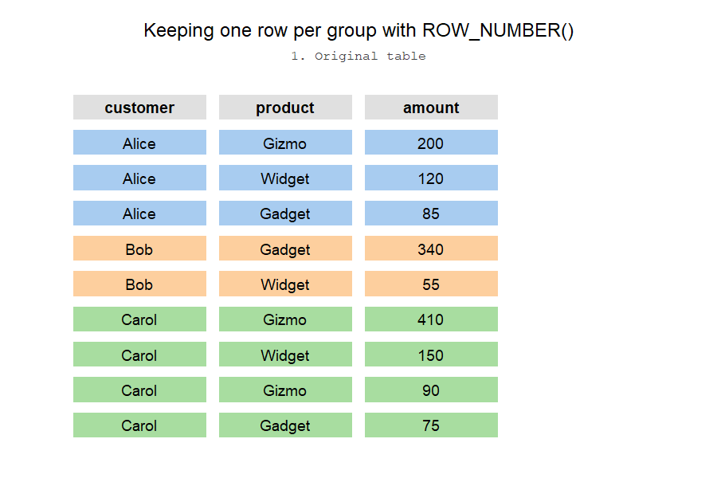

```{r setup}
#| echo: false
#| message: false
#| warning: false

library(duckdb)

con <- dbConnect(duckdb(), "../databases/cookbook.duckdb", read_only = TRUE)

```

# Window Functions

Window functions let you perform calculations across a set of rows that are related to the current row — without collapsing the result into a single summary row the way `GROUP BY` does. They are one of the most powerful features of SQL.

Every window function has the same anatomy:

```
function_name(...) OVER (
    [PARTITION BY column, ...]
    [ORDER BY column, ...]
)
```

* **PARTITION BY** divides the rows into groups (like `GROUP BY`, but the rows stay).
* **ORDER BY** defines the ordering within each partition.

## ROW_NUMBER()

`ROW_NUMBER()` assigns a sequential integer to every row within its partition. The most common real-world use case is **keeping only the first (or last) row per group** — for instance, the most recent order per customer, the highest-scoring student per class, or the latest status change per subscription.

The pattern is always the same:

1. Use `ROW_NUMBER()` with `PARTITION BY` (your group) and `ORDER BY` (your ranking criterion).
2. Wrap it in a CTE or subquery.
3. Filter to `rn = 1`.



Let's see it in action. Say we want the **highest-value order item per product**:

```{.sql .interactive .cookbook}
WITH ranked AS (
    SELECT
        p.product_name,
        o.order_id,
        oi.quantity,
        oi.line_total,
        ROW_NUMBER() OVER (
            PARTITION BY oi.product_id
            ORDER BY oi.line_total DESC
        ) AS rn
    FROM order_items oi
    JOIN products p ON oi.product_id = p.product_id
    JOIN orders o   ON oi.order_id = o.order_id
    WHERE o.status = 'completed'
)
SELECT product_name, order_id, quantity, line_total
FROM ranked
WHERE rn = 1
ORDER BY line_total DESC;
```

Or the **most recent order per customer**:

```{.sql .interactive .cookbook}
WITH ranked AS (
    SELECT
        c.first_name || ' ' || c.last_name AS customer_name,
        o.order_id,
        o.order_date,
        o.status,
        ROW_NUMBER() OVER (
            PARTITION BY o.customer_id
            ORDER BY o.order_date DESC
        ) AS rn
    FROM orders o
    JOIN customers c ON o.customer_id = c.customer_id
)
SELECT customer_name, order_id, order_date, status
FROM ranked
WHERE rn = 1
ORDER BY order_date DESC
LIMIT 15;
```

::: {.callout-tip}
## ROW_NUMBER vs RANK vs DENSE_RANK

* `ROW_NUMBER()` — always assigns unique numbers (1, 2, 3, …), even when values tie.
* `RANK()` — ties get the same rank, but the next rank skips (1, 1, 3, …).
* `DENSE_RANK()` — ties get the same rank, no gaps (1, 1, 2, …).

When you only want `rn = 1`, all three behave the same **if there are no ties**. If ties are possible and you want *all* tied rows, use `RANK()` instead.
:::

## RANK() and DENSE_RANK()

`RANK()` is useful when you want to find the **top N** items and treat ties fairly. Let's rank products by total revenue:

```{.sql .interactive .cookbook}
SELECT
    p.product_name,
    p.category,
    ROUND(SUM(oi.line_total), 2) AS total_revenue,
    RANK() OVER (ORDER BY SUM(oi.line_total) DESC) AS revenue_rank,
    DENSE_RANK() OVER (ORDER BY SUM(oi.line_total) DESC) AS dense_rank
FROM order_items oi
JOIN products p ON oi.product_id = p.product_id
JOIN orders o   ON oi.order_id = o.order_id
WHERE o.status = 'completed'
GROUP BY p.product_id, p.product_name, p.category
ORDER BY revenue_rank;
```

## LAG() and LEAD()

`LAG()` looks at a previous row; `LEAD()` looks at the next one. Perfect for calculating period-over-period changes:


```{.sql .interactive .cookbook}
WITH monthly AS (
    SELECT
        c.year,
        c.month,
        ROUND(SUM(oi.line_total), 2) AS revenue
    FROM orders o
    JOIN order_items oi ON o.order_id = oi.order_id
    JOIN calendar c     ON o.order_date = c.date
    WHERE o.status = 'completed'
    GROUP BY c.year, c.month
)
SELECT
    year,
    month,
    revenue,
    LAG(revenue) OVER (ORDER BY year, month) AS prev_month,
    ROUND(
        100.0 * (revenue - LAG(revenue) OVER (ORDER BY year, month))
        / LAG(revenue) OVER (ORDER BY year, month),
        1
    ) AS mom_growth_pct
FROM monthly
ORDER BY year, month;
```

## Running Totals with SUM() OVER

A window `SUM()` with an `ORDER BY` gives you a cumulative (running) total:

```{.sql .interactive .cookbook}
SELECT
    o.order_id,
    o.order_date,
    ROUND(SUM(oi.line_total), 2) AS order_total,
    ROUND(SUM(SUM(oi.line_total)) OVER (ORDER BY o.order_date, o.order_id), 2) AS running_total
FROM orders o
JOIN order_items oi ON o.order_id = oi.order_id
WHERE o.status = 'completed'
GROUP BY o.order_id, o.order_date
ORDER BY o.order_date, o.order_id
LIMIT 20;
```

## Moving Averages

A **moving average** (also called a rolling or sliding average) smooths out short-term noise so you can see longer-term trends. The key ingredient is the **frame clause**, which tells the window exactly how many rows to look back:

```
AVG(value) OVER (
    PARTITION BY group
    ORDER BY date
    ROWS BETWEEN N PRECEDING AND CURRENT ROW
)
```

`ROWS BETWEEN 6 PRECEDING AND CURRENT ROW` means "this row plus the 6 rows before it" — a 7-row window. Stock prices are the classic example. Here we compute 7-day and 30-day moving averages on Apple's daily closing price:

```{.sql .interactive .stocks}
SELECT
    date,
    ticker,
    close,
    ROUND(AVG(close) OVER (
        PARTITION BY ticker
        ORDER BY date
        ROWS BETWEEN 6 PRECEDING AND CURRENT ROW
    ), 2) AS ma_7d,
    ROUND(AVG(close) OVER (
        PARTITION BY ticker
        ORDER BY date
        ROWS BETWEEN 29 PRECEDING AND CURRENT ROW
    ), 2) AS ma_30d
FROM stocks
WHERE ticker = 'AAPL'
ORDER BY date DESC
LIMIT 30;
```

Notice that the earliest rows in the result have a shorter look-back than requested — DuckDB averages whatever rows are available at the start of the series. If you need `NULL` until a full window is accumulated, guard with `ROW_NUMBER()`:

```{.sql .interactive .stocks}
SELECT
    date,
    close,
    CASE
        WHEN ROW_NUMBER() OVER (PARTITION BY ticker ORDER BY date) >= 7
        THEN ROUND(AVG(close) OVER (
            PARTITION BY ticker
            ORDER BY date
            ROWS BETWEEN 6 PRECEDING AND CURRENT ROW
        ), 2)
    END AS ma_7d
FROM stocks
WHERE ticker = 'AAPL'
ORDER BY date
LIMIT 15;
```

::: {.callout-tip}
## ROWS vs RANGE

`ROWS` counts physical rows; `RANGE` groups all rows that share the same `ORDER BY` value into one peer group. For a daily price series where each date is unique the two behave identically, but if your data can have duplicate dates `ROWS` is the safer default — it never accidentally widens your window.
:::


