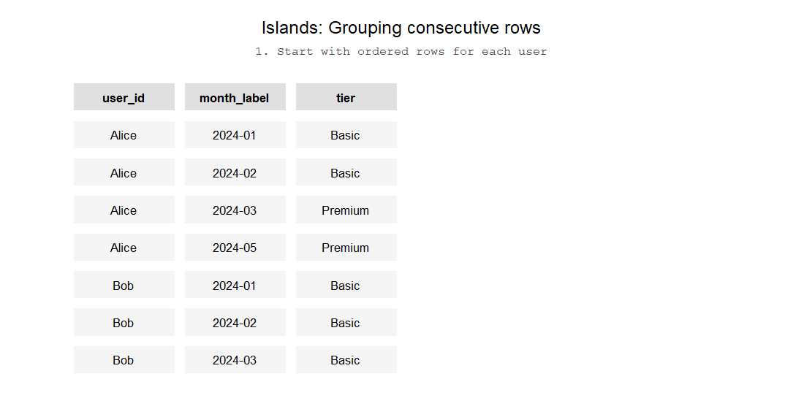

```{r}

#| echo: false
#| message: false
#| warning: false
#| label: setup

library(duckdb)

con <- dbConnect(duckdb(), "../databases/subscriptions.duckdb")

```

# Grouping consecutive rows

::: {.callout-note}

Hey, do you think it would be hard to identify a "session" from all these user events we have?

:::

A lot of data we work with can be ordered by time. Sometimes it's user interactions in a website, sometimes it's a history of contracts with clients. Everyone encounters such a table eventually. Sometimes we are interested in trying to group those rows together. It's easier to understand this with an example. Let's say we're a company selling a streaming subscription service. Let's say Alice and Bob are our users. Alice is very conscious of her services - after subscribing for a year, she paused the service and resumed after a month. Bob doesn't care and auto-renews. If each row is a subscription, Alice has a "break" in her subscription history. Bob doesn't. If we, say, defined loyal users as those without breaks in their subscription history, how could we identify Bob as loyal?

## General theory of finding consecutive rows

Every way of finding consecutive rows is based on calculating the difference between two ranks in your table. The second rank will be partitioned by all the columns you are interested in so that you have a row number for each partition. Then the **first** rank will have one column fewer - essentially created a more general rank. The theory is that if both of these ranks are increasing at the same rate, they must be consecutive and belonging to the same group. Once the second rank reaches the end of the partition - and the second rank will always be shorted than the first one since we're partitioning - the rank counter will reset but the first rank will continue counting up. Now the difference between the ranks is a larger number but if both ranks continue being consecutive, the difference will remain constant because they'll be increasing by one over every row. The chapter below illustrates this principle in practice.




## Grouping consecutive intervals

Now let's answer the question on the second order - how could we group consecutive intervals? For example, if I had subscribed and then renewed my subscription, I have two rows in the database. How could we represent those two rows as a single row with their intervals combined?

What's different from the previous scenario is that intervals do not have a single column to describe their consecutive-ness. For example, my first subscription might have started on January 1st, then my second one starts on March 1st. Previously, the request date by itself encoded the rank. Now we need to create the rank ourselves.


Most data we're working with will contain an incremental id, a timestamp or a creation date. Sometimes, we are interested in grouping rows if the timestamp is consecutive between rows or if the rows have some desired distance between them. For example, we might want to create a session id if events are within 1 hour of each other. Or we might want to group rows if their dates are consecutive. In SQL-land, they're called "islands"[1]:. For me, it's easier to visualise this concept:

```{r}
#| echo: false

library(ggplot2)

ggplot(data_long, aes(x = reorder(name, date, min), y = date)) + 
  geom_line() + 
  scale_y_date(limits = c(as.Date("2007-01-01"),as.Date("2026-01-01")), date_breaks = "2 years", date_labels =  "%Y") +
  coord_flip() + 
  geom_hline(yintercept=as.Date("2016-03-07"), linetype="dashed", 
                color = "#B82B1A", size=1) +
  annotate("text", x=25, y=as.Date("2013-04-07"), label="PRIME scheme launched", color = "#B82B1A") +
  geom_point(aes(color = prime)) +
  geom_text(aes(label = name), size = 3, data = data_long[data_long$event == "authorisation_date",], hjust = -0.3) + 
  theme_bw() + 
  theme(axis.title.y=element_blank(),
        axis.text.y=element_blank(),
        axis.ticks.y=element_blank(),
        panel.grid.major.y = element_blank()) + 
  labs(y = "Day 1 to Marketing Authorisation Timeline", color = "PRIME scheme") + 
  scale_color_manual(values = c("#B82B1A","#289e9a")) + 
  guides(color = FALSE)


```

Gaps are the inverse problem - if there is a gap between two consecutive rows, we would like to infer new rows that show when/where the gap begins and when/where it ends.

There are actually a few use cases for using these methods, so we'll go through all of them.

## Grouping consecutive rows

```{sql, connection = con}

with tmp as (
  select
    row_number() over (partition by user_id order by date_from) as user_rank,
    row_number() over (partition by user_id, tier order by date_from) as tier_rank,
    user_id,
    date_from,
    date_to,
    tier
  from subscriptions
)
select
  user_id,
  tier,
  min(date_from) as date_from,
  max(date_to) as date_to,
  count(*)
from tmp
group by user_id, tier, (user_rank-tier_rank)


```

However, some of the users had gaps in their subscription history. In other words, they sometimes paused their subscriptions, so there are intervals when they were not subscribed. If we wanted to group subscription intervals that were consecutive, what we need is a new column that indicates whether the new subscription started right after the previous one. In a sense, we are deriving a new column with which we will run the same islands recipe.   

```{sql, connection = con}

select 
    *,
    lag(date_to,1) over (partition by user_id order by date_from) as lag_date_to,
    date_from-1 as date_from_minus_1,
    coalesce(lag(date_to,1) over (partition by user_id order by date_from), date_from-1) = (date_from - 1) as is_equal
  from subscriptions
  order by user_id, date_from

```


```{sql, connection = con}

with lag_date_from as (
  select 
    *,
    case when coalesce(lag(date_to,1) over (partition by user_id order by date_from), date_from-1) = (date_from-1) then 1 else 0 end as is_sub_consecutive
  from subscriptions
),
tmp as (
  select
    row_number() over (partition by user_id order by date_from) as user_rank,
    row_number() over (partition by user_id, tier, coalesce(is_sub_consecutive,1) order by date_from) as consecutive_tier_rank,
    user_id,
    is_sub_consecutive,
    tier,
    date_from,
    date_to
  from lag_date_from
)
select 
  user_id,
  tier,
  min(date_from) as date_from,
  max(date_to) as date_to
from tmp
group by user_id, tier, (user_rank-consecutive_tier_rank)
order by user_id, date_from


```


```{sql, connection = con}

with aggregate as (
  select request_submitted_at, count(*) as request_count
  from requests
  group by request_submitted_at
),
tmp as (
  select
    *,
    case when request_count > 2 then 1 else 0 end as is_high_request_day
  from aggregate
),
windowed_tmp as (
  select 
  *,
  row_number() over (order by request_submitted_at) as request_rank,
  row_number() over (partition by is_high_request_day order by request_submitted_at) as high_request_day_rank
  from tmp
)
select 
  is_high_request_day,
  min(request_submitted_at) as request_start,
  max(request_submitted_at) as request_end
from windowed_tmp
group by is_high_request_day, request_rank-high_request_day_rank
order by request_start

/*select *
from windowed_tmp
order by request_submitted_at*/

```


```{sql, connection = con}

with aggregate as (
  select request_submitted_at, count(*) as request_count
  from requests
  group by request_submitted_at
  having request_count > 2
)
select 
  *,
  request_submitted_at - interval (dense_rank() over (order by request_submitted_at)) day as date_group
from aggregate

```


```{sql, connection = con}

with aggregate as (
  select request_submitted_at, count(*) as request_count
  from requests
  group by request_submitted_at
  having request_count > 2
),
aggregate_consecutive as (
select 
  *,
  case 
    when coalesce(lag(request_submitted_at) over (order by request_submitted_at) +1, request_submitted_at) = request_submitted_at 
    then 1
    else 0 
    end as is_consecutive
from aggregate
)
select *
from 

```


https://dba.stackexchange.com/questions/193680/group-rows-by-uninterrupted-dates

## Grouping overlapping rows

## Grouping rows that have a minimal distance

https://stackoverflow.com/questions/53519702/group-rows-with-that-are-less-than-15-days-apart-and-assign-min-max-date


[^1]: As far as I can find the term "Islands and Gaps", I think it was first coined in the [SQL Server MVP Deep Dives](https://www.manning.com/books/sql-server-mvp-deep-dives) book.


