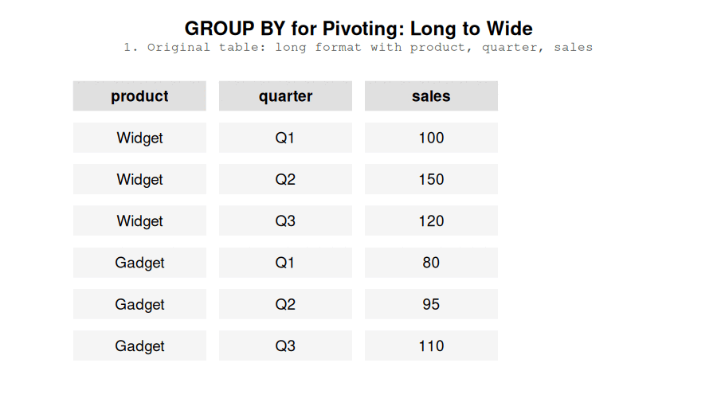

```{r setup}
#| echo: false
#| message: false
#| warning: false

library(duckdb)

con <- dbConnect(duckdb(), "../databases/stocks.duckdb", read_only = TRUE)

```

If you've never done a pivot, strap in! A table is a kind of coordinate system: the columns are the X axis and the rows are the Y axis. FOr example, a calendar is a table where the column are the days of the week and the rows are the weeks. But when we're working with data, usually we just have a column called "week" and a column called "week day" and, of course, a column called "date". The calendar is actually a pivot table. The week day column is turned horizontally and now represents the column names. The dates are then spread out across the table based on the week and week day. If you've imagined this process in your head, congratulations - you've just reached the pivot station.

A pivot table will always have more columns and fewer rows than the original table. That is why pivoting is the act of turning a table from a long format to a wide format. Pivoting a table of dates is very straightforward because each day of the month has exactly one week day and one week. In other words, only a single day can be a Monday on the first week of the year. This is easy. 

Usually, however, you will have multiple values for each row and column combination in your pivot table. For example, let's say you want to present the temperature in your calendar table but the temperature varies throughout the day. It's very normal to *aggregate* values, for example, you might want to show the average temperature, maybe the highest and lowest temperature of the day.

While SQL does support pivots, I prefer pivoting using GROUP BY. First, that's one fewer SQL command to remember - to be honest, I haven't warmed up to the PIVOT command. Second, when using SQL, my primary job is to create reusable data models for downstream use. That means that the data models need to have a fairly consistant schema, i.e. the columns shouldn't change frequently. I really don't want to find that the column I pivot on doesn't contain a value anymore or, in fact, contains a new value. So I pivot on columns that are unlikely to change in the future. A common example is showing monthly values for the past 12 months, one month in each column, 12 columns total. I don't see a 13th month happening in my lifetime.

So, I primarily pivot on columns with few values. That means the syntax is going to take up a similar amount of space, for example:


```{sql, connection = con}

SELECT *
FROM stocks
PIVOT (
    sum(close)
    FOR ticker IN ('AAPL','^VIX')
    GROUP BY date
)
limit 5


```

```{sql, connection = con}

select 
  date,
  sum(case when ticker = 'AAPL' then close end) as AAPL,
  sum(case when ticker = '^VIX' then close end) as VIX
from stocks
group by date
limit 5

```


The amount of code is similar but using GROUP BY results in code that is easier to "scan" - when reading the code, I don't need to parse the pivot in my head and "guess" what happens.

Secondly, GROUP BY for pivoting provides something other languages don't - conditional pivoting. That means I can add a condition inside of my aggregation or use a different aggregation altogether:

```{sql, connection = con}

select 
  date,
  sum(case when ticker = 'AAPL' then close end) as AAPL,
  sum(case when ticker = '^VIX' then close end) as VIX
from stocks
group by date
limit 5

```


So you know how tables have column names? Pivoting is the act of representing the data so that one of the columns gets transformed into column names. 


A table, in a sense, has axes. The X axis is columns, the Y axis is rows. Pivoting is the act of taking a column and 


Pivoting is the act of representing data in a wider format by using one column 

Pivoting is the act of transforming a table from a long format to a wide format.  


At this point it's likely you're using a database that supports pivoting and unpivoting but it's good to know how to do it yourself.

# Pivoting

The most basic way to pivot is to use a CASE statement for each column you want to pivot.



# Advanced Pivoting

Why I like pivoting in SQL is that I can create arbitrary case when statements to control how my data is pivoted:

# Unpivoting

I wish you don't ever need to unpivot manually in SQL. A universal way to unpivot in SQL is to take each column of interest and do a UNION ALL.

# References

https://sqlperformance.com/2019/09/t-sql-queries/t-sql-pitfalls-pivoting-unpivoting

# Pivoting and Unpivoting

Pivoting refers to a transformation where you take two columns: one containing values that will represent the names of your columns and another containing the values that you want those columns to contain. In a sense, we're making our data wider (`dplyr`'s R refers to pivoting and unpivoting as `pivot_wider` and `pivot_longer`, respectively). Accordingly, unpivoting collects your column names into one column and the contents of those columns into another. 

Chances are that your tooling allows you to perform these operations. Unless, of course, you are an unlucky fellow or you prefer to roll your own code.

## Pivoting

Pivoting in SQL looks like this:

If you need to pivot into a lot of columns, you are going to have a bad time. First, you need to specify each column that is *not* being pivoted into the select statement as well as the group by clause. Second, you need to manually type out each column that appears in the pivot. 

Nonetheless, I love pivoting in SQL because you can individually define how each column is pivoted. Maybe you need to average one column, but sum another? Maybe you want to add two conditional statements when you are pivoting `Activity = 'Running'`? I've done my fair share of intricate SQL pivots that would have taken me much more time in other languages.

## Unpivoting

Unpivoting is a little tricky in SQL. Essentially, we'll be creating multiple select statements for each column we would like to unpivot, with each select statement containing a different column:

I don't love unpivoting in SQL. When pivoting, a single line of code translates into a column, whereas a single column translates into a whole separate SQL statement. Please use some framework or an engine that supports unpivoting through a function (e.g. Snowflake's `UNPIVOT` or dbt's `unpivot` macro).


