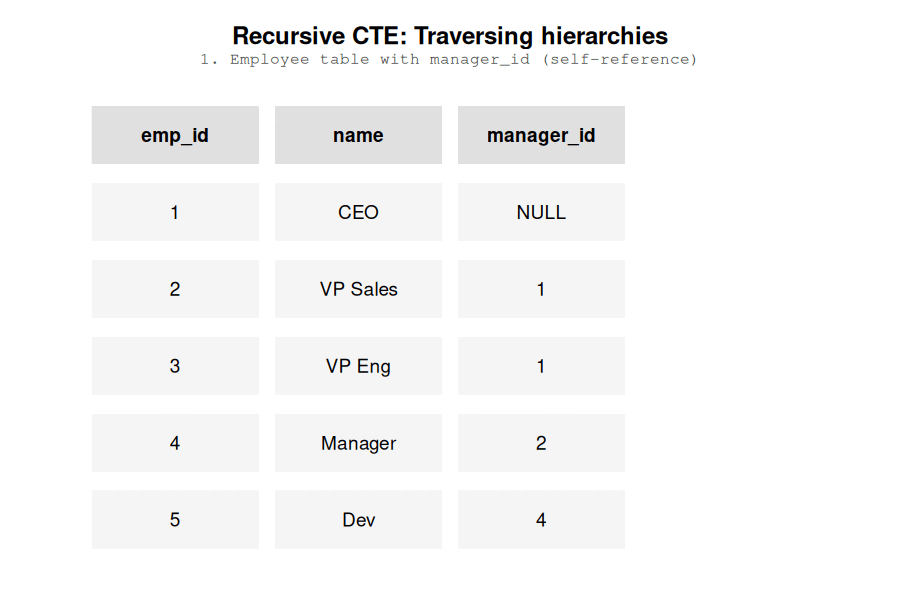

I don't like recursive queries because they're too rare in the wild and their syntax is not intuitive. To be fair, this section is more for my own self-learning.



## Qualify events based on first event

In 2024, Erika Pullum shared [a great SQL brainteaser on BlueSky](https://bsky.app/profile/erikapullum.bsky.social/post/3lcy2ha372s2n). Given a list of dates, the first date qualifies as TRUE and all subsequent dates qualify if it’s been more than 90 days since the last one. This requires a recursive CTE to solve because the 90 day gaps depend on the first row in the dataset.


Erika Pullum posted a great SQL teaser - I'm not sure what's the use case but it's a great way to apply recursive CTEs.

```{r}

library(duckdb)

con <- dbConnect(duckdb::duckdb(), ":memory:")

dbSendStatement(con, "create table events as
                select '2024-06-10'::date as d

                UNION ALL

                select '2024-08-20'::date as d

                UNION ALL

                select '2024-08-22'::date as d

                UNION ALL

                select '2024-09-17'::date as d

                UNION ALL

                select '2024-09-19'::date as d

                UNION ALL

                select '2024-11-01'::date as d

                UNION ALL

                select '2024-12-11'::date as d

                UNION ALL

                select '2024-12-21'::date as d
                ")

```


```{sql, connection=con}
#| eval: false

with recursive recursive_cte as (
  select
    min(d) as d,
    TRUE as is_after_cooldown
  from events

  union all

  select
    min(events.d) as d,
    TRUE as is_after_cooldown
  from events
  inner join (select max(d) as d from recursive_cte) as r
    on events.d > r.d + interval 90 day
)
select *
from recursive_cte


```


```{sql, connection=con}

with recursive recursive_cte as (

    select 
        min(events.d) as d
    from events

    union all
    
    SELECT 
        min(recursive_events.d) as d
    from events recursive_events
    inner join (select max(d) as d from recursive_cte) latest_date
        on recursive_events.d > latest_date.d + 90 
    having min(recursive_events.d) is not null
    
)
select 
    events.d,
    case when recursive_cte.d is not null then true else false end as is_after_cooldown
from events
left join recursive_cte 
    on events.d = recursive_cte.d
order by events.d 


```


